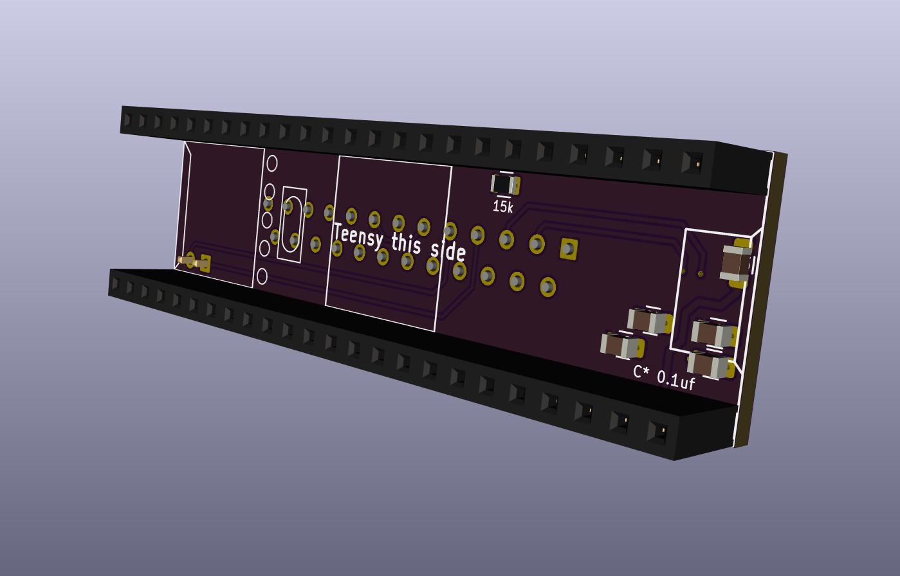

# MonT
"Monty" - MCU on Model T

These are adapter boards to attach some common small DIP form factor microcontroller boards directly to "Model T" computers by the serial port.

Particularly, boards with integrated SD card readers, for use with [PDDuino](https://github.com/bkw777/PDDuino).

You can power the microcontroller board from the computer using a [BCR-USB power adapter](https://github.com/bkw777/BCR_Breakout)

These adapter boards provide:  
* male db25 connector  
* RX/TX and DSR/DTR wiring to the mcu  
* max3232 level-shifting between rs232 and cmos/ttl  
* hold the mcu board  

"Model T" computers are:  
 TRS-80/TANDY Model 100, 102, 200, 600  
 NEC PC-8201, PC-8201a, PC-8300  
 Olivetti M10  
 Kyotronic KC-85  
 
 Adafruit Feather (all varieties)  
 Teensy 3.5, 3.6, 4.1  (other models too, they don't have sd-card readers built-in, but the power and serial lines are the same so you could plug them in)

coming:  
 Heltec HTIT-W8266, HTIT-WB32  

## Microcontroller boards  

### Adafruit Feather
  

PCB: <https://oshpark.com/shared_projects/SJvmg6U8> 
Minimum BOM: <https://www.digikey.com/short/zr1w1h> 
Everything BOM: <https://www.digikey.com/short/zr1dph> 

This adapter works for both the 32u4 and the M0 versions of Adalogger, as well as all other Feather boards.  
Adalogger 32u4 and M0 are useful to run [PDDuino](https://github.com/bkw777/PDDuino).

### Teensy
  
  
 

PCB: <https://oshpark.com/shared_projects/S8etnOx1>
Minimum BOM: <https://www.digikey.com/short/zr1w1h> 

### Heltec HTIT-W8266
coming

### Heltec HTIT-WB32
coming

## notes
At power-on the Model 100 rs232 port sets all data & control pins to -5v.
On RUN "COM:98N1E", pins 4 and 20 go to +5v.

