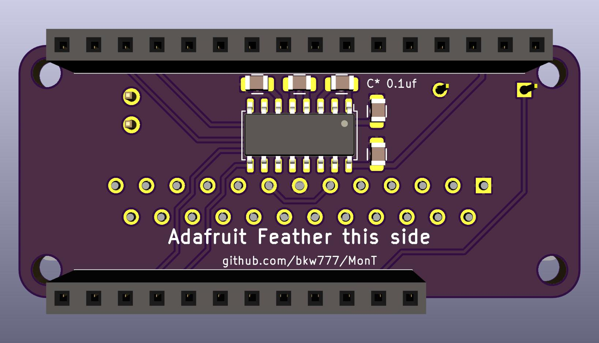
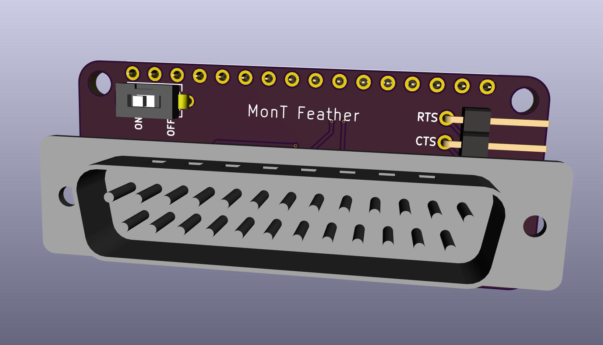
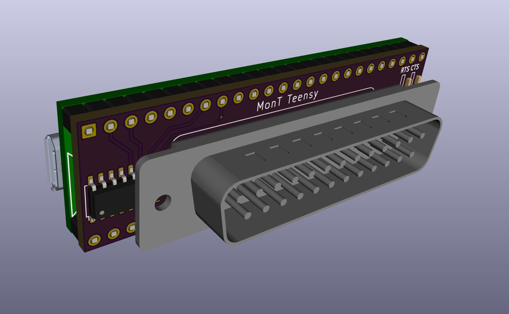
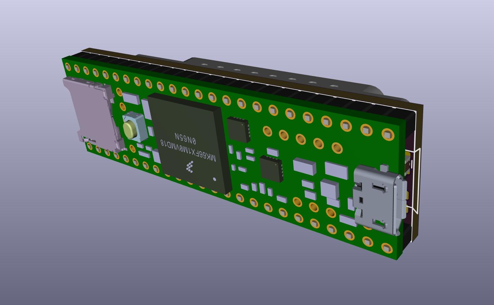

# MonT
"Monty" - MCUs on Model T computers

These are adapter boards to attach some common small DIP form factor microcontroller boards directly to "Model T" computers.

Particularly, boards with integrated SD card readers, for use with [PDDuino](https://github.com/bkw777/PDDuino).

You can power the microcontroller board from the computer using a [BCR-USB power adapter](https://github.com/bkw777/BCR_Breakout)

You can get any of these boards manufactured by just uploading the .kicad_pcb file to OSHPark.

There is only one adapter right now which supports any Adafruit Feather board.

These adapter boards provide:  
* male db25 connector  
* null-modem wiring to the mcu  
* max3232 level-shifting between rs232 and cmos/ttl  
* hold the mcu board  

"Model T" computers are:  
 TRS-80/TANDY Model 100, 102, 200, 600  
 NEC PC-8201, PC-8201a, PC-8300  
 Olivetti M10  
 Kyotronic KC-85  
 
Microcontroller boards:  
 Adafruit Feather (all varieties)  

coming:  
 Teensy 3.5, 3.6, 4.1  
 Heltec HTIT-W8266, HTIT-WB32  

## Adafruit Feather
  

Get the PCB from OSHPark: <https://oshpark.com/shared_projects/BrN84Pyj> 
Get the parts from Digi-Key: <https://www.digikey.com/short/zrb4mr> 

The Digi-Key cart includes everything, including things you may not need.  
You may want to remove:  
* Battery - you can get power from the BCR port, or you might already have one  
* Socket headers - you can solder the Feather board directly  
* Adalogger - you might already have one

This adapter works for both the 32u4 and the M0 versions of Adalogger, as well as all other Feather boards.  
Adalogger 32u4 and M0 are useful to run PDDuino to make a TPDD emulator.

## Teensy

PCB from OSHPark: <https://oshpark.com/shared_projects/YRLMUJzR>

## Heltec HTIT-W8266
coming

## Heltec HTIT-WB32
coming
