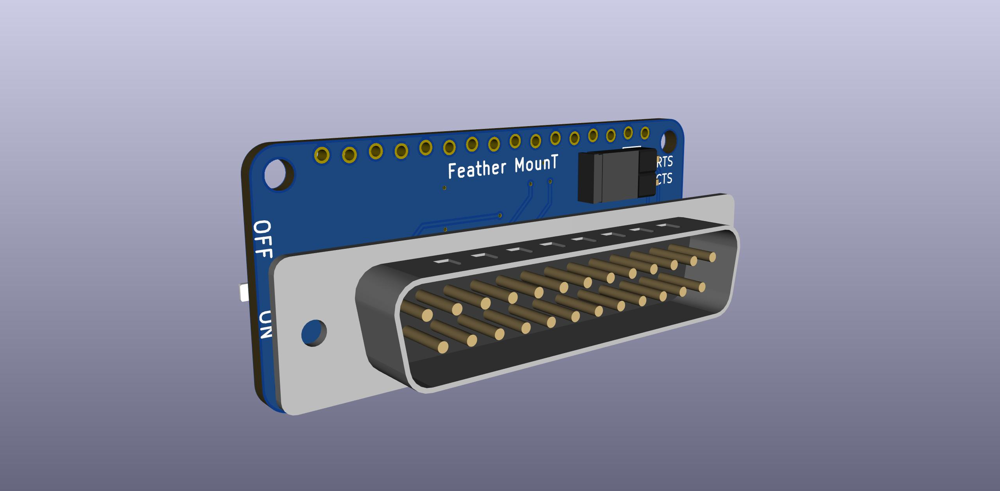
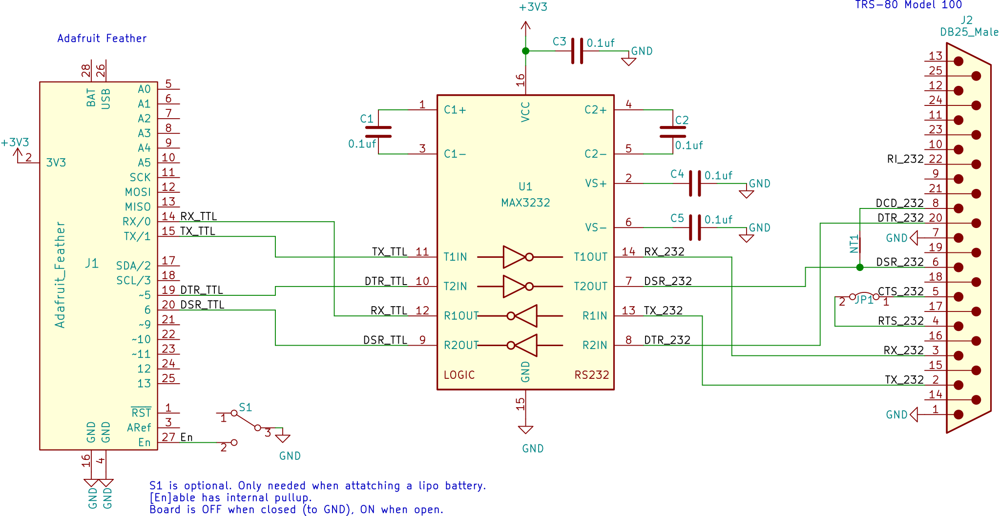

# MounT
Mount a microcontroller dev board on a "Model T"

This repo has a few different adapter boards to attach some common small DIP form factor microcontroller boards directly to "Model T" computers by the serial port.

Particularly, boards with integrated SD card readers, for use with [PDDuino](https://github.com/bkw777/PDDuino).

You can power the microcontroller board from the computer using a [BCR-USB power adapter](https://github.com/bkw777/BCR_Breakout)

These adapter boards take the place of a serial cable, gender/null-modem adapters, rs-232/ttl level-shifter module, and breadboard, and let you stick the microcontroller board directly onto the serial port of a TRS-80 Model 100 or any of it's clones.

"Model T" computers are:  
 TRS-80/TANDY Model 100, 102, 200, 600  
 NEC PC-8201, PC-8201a, PC-8300  
 Olivetti M10  
 Kyotronic KC-85  

There is also one adapter for Adafruit Feather to Cambridge Z88, and one for TANDY WP-2

These adapters employ a staggered row footprint for the pin headers, which acts like a friction fit socket to connect the microcontroller board to the adatpter board without having to solder it permanently and without needing actual sockets. 
This way the microcontroller board is still removable like with a socket, yet low profile as if you had soldered it with no sockets. 

You can still install real sockets if you want to, or solder the microcontroller board permanently if you want to.

One feature of normal socket headers that can be either good or bad, is they are 8.5mm tall. That makes the controller board stick out more than it needs to, but it also provides a handy space between the microcontroller board and the adapter board where you can stuff a lipo battery, or stuff the excess usb cable from the BCR port adapter.

These adapers (so far), make the following connections between the "Model T" and the microcontroller:
<pre>
Model T              MCU
TX  --> MAX3232 -->  RX  (first/main non-usb hardware serial port RX pin)
RX  <-- MAX3232 <--  TX  (first/main non-usb hardware serial port TX pin)
DTR --> MAX3232 -->  5   (Arduino pin 5)
DSR <-+ MAX3232 <--  6   (Arduino pin 6)
DCD <-+
CTS --- \jumper
RTS --- /
</pre>

## Microcontroller Board Options

### Adafruit Feather
  
  
  

PCB from PCBWAY: <https://www.pcbway.com/project/shareproject/Feather_MounT.html> (remember to select ENIG finish unless you're soldering the feather board)  
PCB from OshPark: <https://oshpark.com/shared_projects/61udqrJB>  
BOM: <https://www.digikey.com/short/zf3z0p>

Adafruit Feather Adalogger boards can be powered by a lipo battery instead of, or as well as, the BCR port adapter (or other usb power source). 
The Feather board includes both a JST connector for a lipo cell, and an on-board lipo cell manager so that it charges when you supply power to the usb port, and provides power when there is no power from the usb port. 

Avoid connecting a battery and the BCR port adapter at the same time. The charging circuit on the Feather board will try to charge the battery at 100ma any time there is power available from the usb port. But that is too much current to draw from the BCR port. So, either connect a battery, OR the BCR port adapter, not both at the same time. 
If you are going to use a battery, you can charge it by just connecting any usb power source (except the BCR port adapter) to the usb port.

There are many Adafruit Feather boards, and they would all work with this. But for PDDuino you want either Feather 32u4 or Feather M0.  
M0 has a newer more powerful cpu and more ram, but is actually a bit less reliable due to some problem with the Adafruit board support library. There is a known problem with the SPI timing, which apparently was a deliberate choice by Adafruit to get more performance for audio applications at the expense of stability.  
32u4 is the older and smaller cpu and less ram, but it actually works perfect for PDDuino.  
Other feather boards could possibly be used for wifi/rf or general use, but they don't have sd card readers built-in.

### Teensy 3.5/3.6/4.1
  
  
  

PCB: <https://oshpark.com/shared_projects/4yMVoJ95>  
BOM: <https://www.digikey.com/short/zfjrd3>  

The Teensy 3.5 (vs 3.6) is particularly interesting as it's i/o pins are 5v tolerant.  
The Teensy 3.5/3.6 are far more powerful and have far more built-in hardware & features, but do have a couple downsides compared to Feather.  
The pins are symmetrical which means there is no polarity protection. It's always possible to plug the teensy in backwards.  
The Teensy does not have a built-in lipo charger and connector. It can run off the BCR port, but it would take more added hardware to run off a battery, and even more to have that battery be automatically charged from the usb port.  
The Teensy sd card reader does not have it's sense switch connected to any i/o pins. This means the arduino code can not automatically detect when the card is ejected. This means PDDuino can't automatically reset and return to "waiting-for-card" state the way Feather can and does. The card slot does have a sense switch, so you could manually solder connections to it and uncomment a few lines in the code to use it.  

### Heltec HTIT-W8266
coming

### Heltec HTIT-WB32
coming

# These versions fit other computers besides Model 100 and other "Model T's"

## Feather MounT for Cambridge Z88
There is a version of the Feather board for the Cambridge Z88  
PCB: <https://oshpark.com/shared_projects/JzfpyaOQ>  
BOM: <https://www.digikey.com/short/zfw4vt>  
  
  
  

## Feather MounT for TANDY WP-2
There is a version of the Feather board for the TANDY WP-2  
PCB: <https://oshpark.com/shared_projects/67NyaQRs>  
BOM: <https://www.digikey.com/short/z25pz5>  
  
  
  
