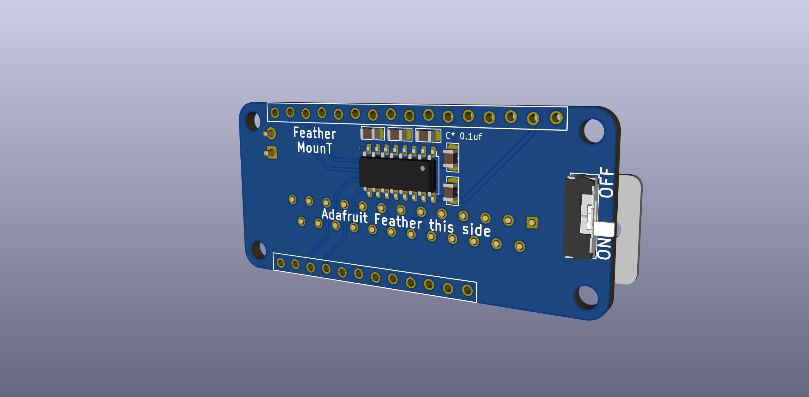
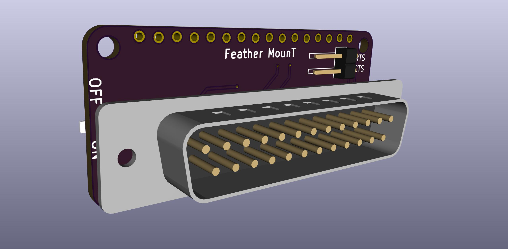
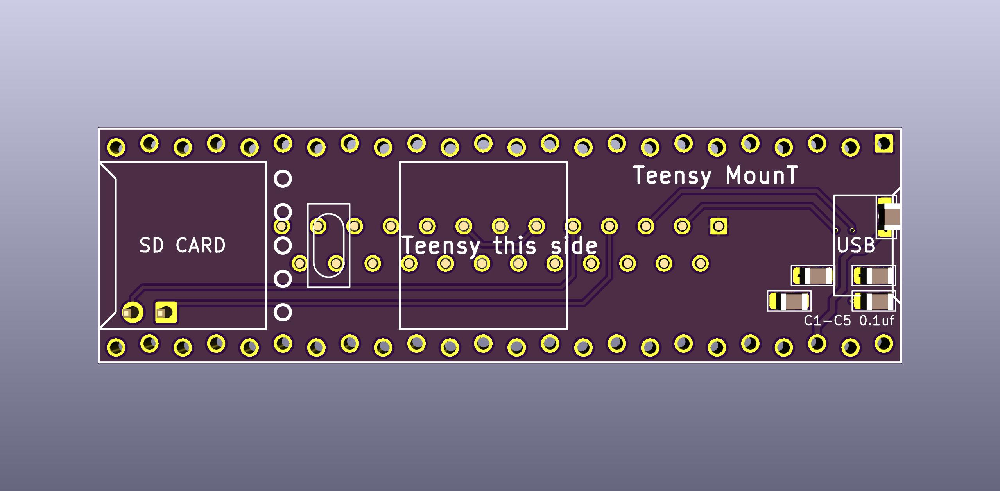
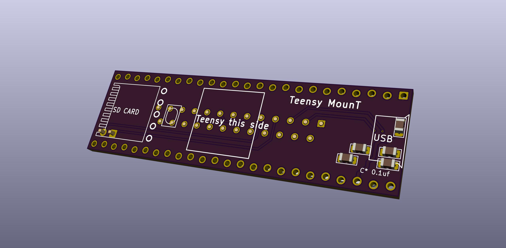

# MounT
Mount an MCU on a Model T

These are adapter boards to attach some common small DIP form factor microcontroller boards directly to "Model T" computers by the serial port.

Particularly, boards with integrated SD card readers, for use with [PDDuino](https://github.com/bkw777/PDDuino).

You can power the microcontroller board from the computer using a [BCR-USB power adapter](https://github.com/bkw777/BCR_Breakout)

These adapter boards provide:  
* male db25 connector  
* RX/TX and DSR/DTR wiring to the mcu  
* max3232 level-shifting between rs232 and cmos/ttl  
* hold the mcu board  

"Model T" computers are:  
 TRS-80/TANDY Model 100, 102, 200, 600  
 NEC PC-8201, PC-8201a, PC-8300  
 Olivetti M10  
 Kyotronic KC-85  
 
These boards employ a staggered row footprint for the pin headers which acts like a friction fit socket to connect the mcu board to the adatpter board without having to solder it permanently and without needing sockets. 
This way the mcu board is still removable like with a socket, yet very low profile when installed like with no socket. 
You can still solder everything or install real sockets if you want. One feature of normal socket headers is they are 8.5mm tall, and that provides a space between the mcu board and the adapter board where you can stuff a lipo battery or the excess usb cable from the BCR port adapter.

These boards (so far), make the following connections between the "Model T" and the mcu board:
<pre>
Model T              MCU
TX  --> MAX3232 -->  RX  (first/main non-usb hardware serial port RX pin)
RX  <-- MAX3232 <--  TX  (first/main non-usb hardware serial port TX pin)
DTR --> MAX3232 -->  5   (Arduino pin 5)
DSR <-+ MAX3232 <--  6   (Arduino pin 6)
DCD <-+
CTS --- \jumper
RTS --- /
</pre>

## Microcontroller Boards  

### Adafruit Feather
  

PCB: <https://oshpark.com/shared_projects/hvgPV7Mf> 
BOM: <https://www.digikey.com/short/zf3z0p>

Adafruit Feather Adalogger boards can be powered by a lipo battery instead of, or as well as, the BCR port adapter (or other usb power source). 
The Feather board includes both a JST connector for a lipo cell, and an on-board lipo cell manager so that it charges when you supply power to the usb port, and provides power when there is no power from the usb port. 

Avoid connecting a battery and the BCR port adapter at the same time. The charging circuit on the Feather board will try to charge the battery at 100ma any time there is power available from the usb port. But that is too much current to draw from the BCR port. So, either connect a battery, OR the BCR port adapter, not both at the same time. 
If you are going to use a battery, you can charge it by just connecting any usb power source (except the BCR port adapter) to the usb port.

### Teensy
  
  

PCB: <https://oshpark.com/shared_projects/ce6Cn56L> 
BOM: <https://www.digikey.com/short/zf34pp>

### Heltec HTIT-W8266
coming

### Heltec HTIT-WB32
coming
